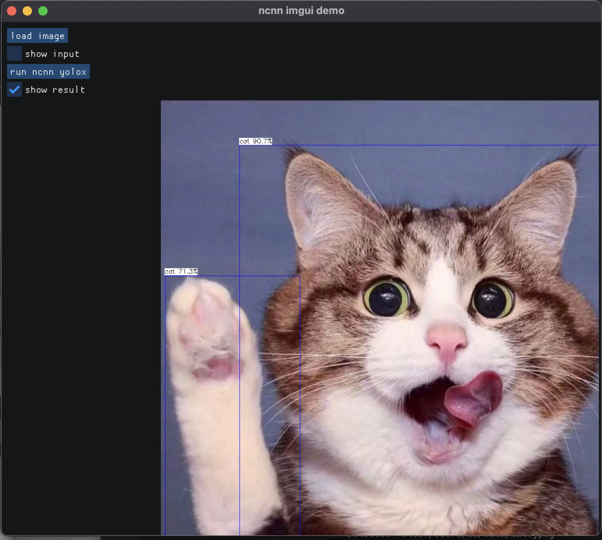

# ncnn-imgui-demo

## Intro
Lightweight (n)cnn inference GUI program example with the combination of [ncnn](https://github.com/tencent/ncnn) and [imgui](https://github.com/ocornut/imgui).

This may help people:
- Visually inspecting the result of an (n)cnn model inference when its input and output are images
- Replace the heavy, *license-not-friendly* Qt

## Screenshot


## Build
Require some dependencies, see [cvpkg.json](cvpkg.json) for reference, see [cmake/deps.cmake](cmake/deps.cmake) for actual configuration.

Then use usual cmake way for building
```bash
mkdir build
cd build
cmake ..
make -j4
./ncnn_imgui_demo
```

## Modify
For simplicity, this demo use the "yolox" object detection network from ncnn examples. Feel free to modify it in [ncnn_yolox.hpp](ncnn_yolox.hpp) and [ncnn_yolox.cpp](ncnn_yolox.cpp).